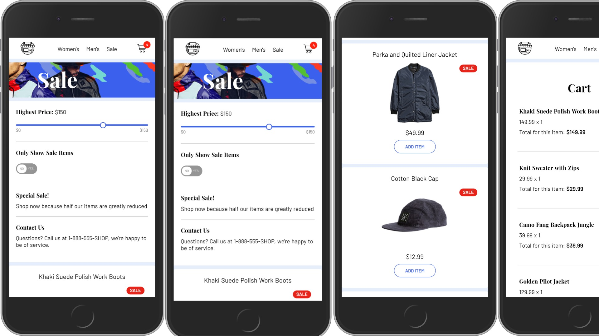

# Angular Shop

This small project demos an ecommerce application setup with Angular, using local data(could be replaced with a remote data source).



Live URL: `https://angular-shop.netlify.app/`

## Build Setup

```bash
# install dependencies
$ npm install

# serve with hot reload at localhost
$ ng serve

# build for production
$ ng build --prod
```

## Todo

- Add logic for duplicate cart items
- Migrate to remote data source
- Integrate payment
